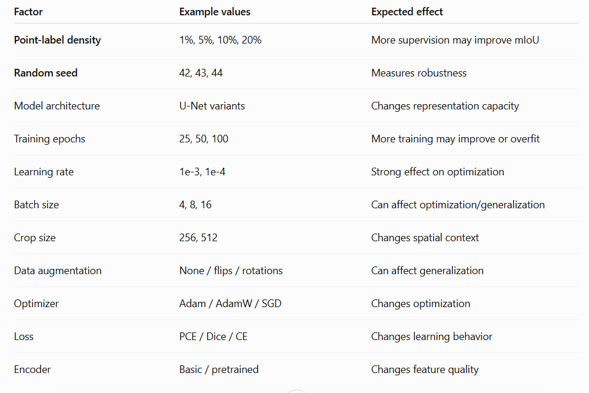

# Technical Assessment Report

## Partial Cross-Entropy Loss for Sparse Point-Supervised OpenEarthMap Segmentation

### 1. Objective

The assessment asks for:

1. An implementation of Partial Cross-Entropy (PCE) loss.
2. An OpenEarthMap remote-sensing semantic-segmentation dataset with randomly simulated point labels and integration of the loss into a segmentation network.
3. Controlled experiments investigating one or two performance factors, including the experimental method, hypothesis, process, and measured results.

The objective is to investigate whether a semantic-segmentation model can be effectively trained using only sparse point-level supervision rather than dense pixel-level annotations.

---

## 2. Dataset

We selected the **OpenEarthMap** dataset for remote-sensing semantic segmentation. OpenEarthMap is a large-scale, high-resolution land-cover mapping dataset containing satellite and aerial imagery collected from diverse geographic regions around the world.

The dataset provides high-resolution RGB imagery together with pixel-level semantic land-cover annotations. The geographic diversity of OpenEarthMap makes it suitable for evaluating segmentation models under different environmental and land-cover conditions.

For this assessment, RGB imagery is used as the model input, while the original dense segmentation masks are retained as the reference annotations for evaluation.

During training, the dense masks are converted into simulated sparse point annotations. Only randomly selected pixels are exposed to the model as labeled training points, while the remaining pixels are treated as unlabeled.

The dense validation masks are not sparsified and are used to evaluate the model's full-resolution segmentation predictions.

---

## 3. Method

### 3.1 Segmentation Model

A standard U-Net encoder-decoder architecture is used as the semantic-segmentation network.

The model receives RGB images with three input channels and produces a dense per-pixel prediction over the semantic classes defined by OpenEarthMap.

The final layer produces one logit for each semantic class at every spatial location.

---

### 3.2 Simulated Point Labels

Because the original OpenEarthMap annotations are dense segmentation masks, sparse point supervision is simulated from these masks.

For each training mask, a fraction `p` of valid pixels is randomly selected.

For example, with a point fraction of 5%, approximately 5% of the valid pixels are retained as labeled points.

The selected pixels retain their original semantic class labels, while all other pixels are assigned `-1`, representing unlabeled locations.

Formally, for a dense ground-truth mask `Y`, the sparse supervision mask `Y'` is defined as:

\[
Y'_i =
\begin{cases}
Y_i, & i \in \Omega_L \\
-1, & i \notin \Omega_L
\end{cases}
\]

where:

- `Y_i` is the original class label.
- `Ω_L` is the set of randomly selected labeled pixels.
- `-1` represents an unlabeled pixel.

The sparse point labels are regenerated according to the experimental random seed.

---

### 3.3 Partial Cross-Entropy Loss

Let the network output logits `z_i` for each pixel `i`, and let `Ω_L` represent the set of labeled points.

The Partial Cross-Entropy loss is defined as:

\[
L_{PCE}
=
-\frac{1}{|\Omega_L|}
\sum_{i \in \Omega_L}
\log p(y_i \mid x_i)
\]

where:

- `y_i` is the ground-truth class of labeled point `i`.
- `p(y_i | x_i)` is the predicted probability of the correct class.
- `Ω_L` contains only the sampled labeled points.

In implementation, this is equivalent to standard multiclass Cross Entropy with an `ignore_index` of `-1`.

Therefore, unlabeled pixels do not contribute to the training loss:

```python
loss = F.cross_entropy(
    logits,
    sparse_mask,
    ignore_index=-1
)
```

The segmentation model still produces a dense prediction over the entire image. However, the gradient is calculated only from the pixels for which point-level labels are available.

---

## 4. Experimental Design

### Experiment 1 — Point-Label Density

**Purpose:** Determine how the amount of sparse point supervision affects OpenEarthMap segmentation performance.

**Hypothesis:** Increasing point-label density should generally improve segmentation performance because the model receives direct supervision at more spatial locations.

However, the improvement is expected to diminish at higher point densities because additional labeled points provide progressively less new information.

The following point-label fractions are evaluated:

- 1%
- 5%
- 10%
- 20%

For each point density, training is repeated using three independent random seeds:

- 42
- 43
- 44

This allows both the effect of supervision density and the variability caused by random point selection to be measured.

---

### Experiment 2 — Random-Seed Robustness

**Purpose:** Determine how sensitive point-supervised segmentation is to the particular locations selected as training points.

For each point density, three independent random seeds are used.

The same model architecture, optimizer, learning rate, number of epochs, preprocessing pipeline, and training data are maintained across all runs.

Only the random sampling of labeled pixels and other seed-dependent operations are changed.

The mean and standard deviation of the resulting metrics are reported.

A lower standard deviation indicates that the method is less sensitive to the particular sampled points.

---

## 5. Experimental Process

The complete experimental pipeline is:

1. Load OpenEarthMap RGB images and corresponding dense segmentation masks.
2. Split the data into training and validation sets according to the selected dataset split.
3. Crop or resize images and masks to a fixed training size.
4. Apply the same spatial augmentations to the image and corresponding mask.
5. Sample a fixed fraction of valid pixels from each training mask.
6. Retain the original class labels at the sampled pixels.
7. Assign `-1` to all non-selected pixels.
8. Pass the RGB image through the U-Net segmentation network.
9. Compute Partial Cross-Entropy only on the sampled labeled points.
10. Update the model using the AdamW optimizer.
11. Repeat training for each point-label density.
12. Repeat each density using seeds 42, 43 and 44.
13. Evaluate the model using the complete dense validation masks.
14. Calculate mIoU, pixel accuracy, macro precision, macro recall and macro F1.
15. Store the metrics for each experiment.
16. Calculate the mean and standard deviation across the three random seeds.

The validation masks remain dense because the purpose of evaluation is to determine how well a model trained from sparse point supervision can recover the complete semantic segmentation.

---

## 6. Results

The following table should be populated using the generated `history.json` files.

## 7. Interpretation

The primary comparison is the relationship between point-label density and segmentation performance.

If the measured results show that mIoU increases as the point-label fraction increases, this would support the hypothesis that additional point supervision improves the model's ability to learn spatial and semantic patterns.

However, no improvement should be claimed unless it is supported by the measured results.

The standard deviation across random seeds provides an indication of training stability. A large standard deviation would suggest that model performance is sensitive to the locations of the randomly selected supervision points.

If the standard deviation decreases as point density increases, this may indicate that denser point supervision makes the training process less dependent on the particular random sampling pattern.

The most important metric for comparing segmentation quality is mIoU because it evaluates the overlap between predicted and ground-truth regions across semantic classes.

Pixel accuracy is also reported, but it should not be considered the only indicator of performance because class imbalance can cause pixel accuracy to appear high even when minority classes are poorly segmented.

Macro F1 provides an additional class-balanced measure by giving equal importance to each semantic class.

---

## 8. Limitations

Several limitations should be considered when interpreting the results.



### 8.1 Simulated Point Annotations

The point labels are generated from the original dense OpenEarthMap masks rather than collected from human annotators.

Consequently, the experiment measures the effect of sparse supervision under controlled sampling rather than the full challenges associated with real point annotation.

### 8.2 Uniform Random Sampling

The simulated points are selected randomly and uniformly from valid pixels.

Real annotation strategies may intentionally select representative objects, boundaries, difficult regions, or rare classes.

Therefore, uniform random sampling may not accurately represent all practical point-supervision strategies.

### 8.3 RGB Input

The experiment uses RGB imagery only.

Although OpenEarthMap contains high-resolution remote-sensing imagery, additional spectral or multispectral information, when available in alternative datasets or data products, is not considered in this experiment.

### 8.4 Geographic Diversity

OpenEarthMap contains imagery from different geographic regions and environments. Differences in landscape, acquisition conditions, spatial characteristics and land-cover distributions may affect the model's performance.

A model trained on a particular subset may therefore not generalize equally well to all geographic regions.

### 8.5 Experimental Scale

A small experimental subset may be appropriate for development and rapid experimentation, but its results should not be presented as a definitive benchmark for OpenEarthMap.

### 8.6 Training Configuration

The results may depend on:

- Image crop size
- Batch size
- Number of training epochs
- Learning rate
- Optimizer
- Data augmentation
- U-Net architecture
- Hardware
- Random seed
- Training subset

Therefore, these parameters should be kept constant when comparing point-label densities.

---

## 9. Conclusion

This implementation provides a complete experimental pipeline for studying Partial Cross-Entropy under sparse point supervision using OpenEarthMap.

The pipeline consists of:

1. OpenEarthMap RGB remote-sensing imagery.
2. Dense OpenEarthMap segmentation masks used as the reference annotations.
3. Random simulation of sparse point-level labels.
4. A U-Net semantic-segmentation model.
5. Partial Cross-Entropy computed exclusively at labeled points.
6. Dense evaluation against the complete validation masks.
7. Controlled experiments using 1%, 5%, 10% and 20% point-label densities.
8. Three independent random seeds for measuring robustness.
9. Evaluation using mIoU, pixel accuracy, macro precision, macro recall and macro F1.

The final conclusions should be written only after the measured results.

In particular, the final report should avoid assuming that higher point density improves performance. Any improvement, degradation, saturation, or instability should be reported according to the actual experimental measurements.